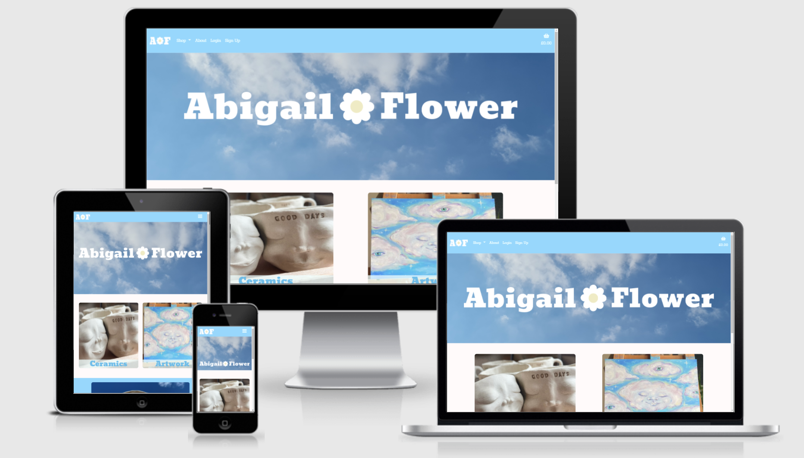
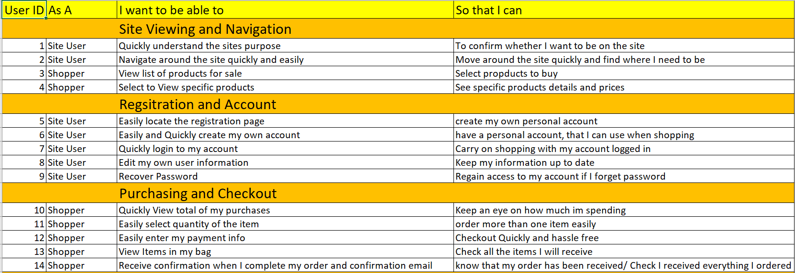
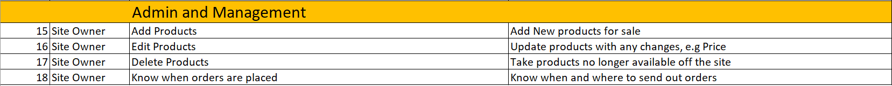
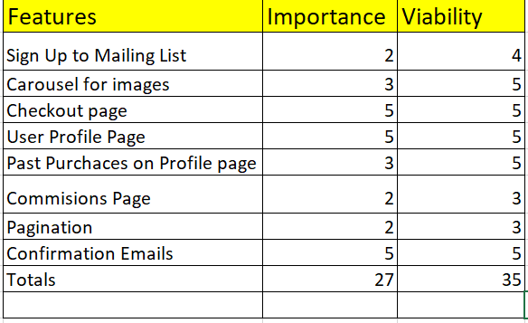
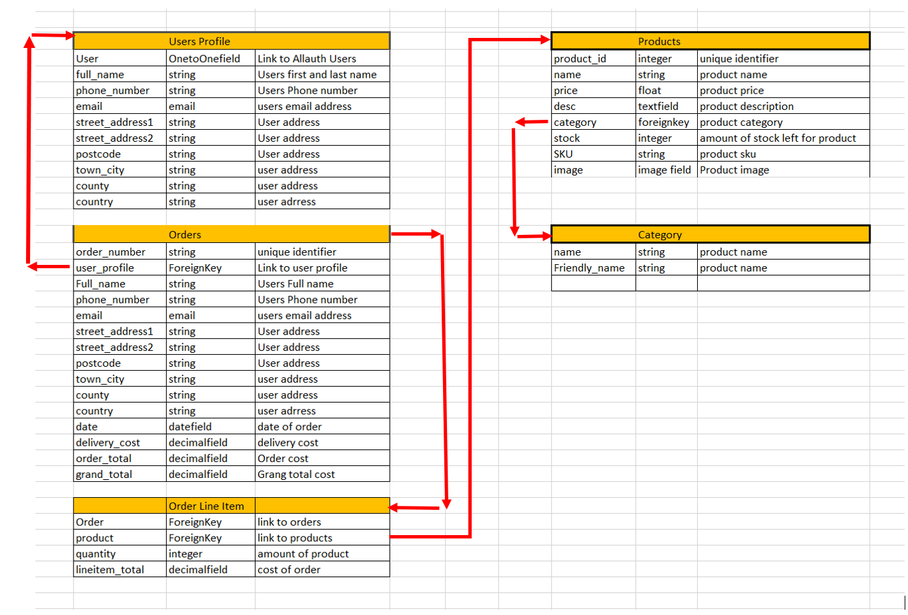

<h1 align="center">Abigail Flower Store Project</h1>

[View Live Project Here](https://abigail-flower.herokuapp.com/)



Welcome to my milestone project for Code Institute Full Stack Frameworks with Django module. 
The Scope of the module was to build a fullstack site based around business logic used to control a centrally owned dataset.
The Site I have decided to build is a web store based around a my sisters art. 
The website sells original paintings and ceramics all painted and hand made by her.
AWS is used to hoast the static and media files, while heroku is used to host the site.

## User Experience (UX)

- ### User Stories
    
- ### Site Owner Goals
    

- ### Project Scope Plane
    While in the planning stage of the project I used the user stories and site owners goals to come up with a scope plane and features to include within the project.
    After coming up up with a list of features I created a feature importance and viability table which is below.

    

## Design

* ### Typography
    The two fonts used on the project are *Bevan* for the page titles and logo, and *Rokkit* which is used for the main font throughout the project.
* ### Color Scheme
    The colour scheme for the project is ##f0ffff(Azure) and #90d4fcec(Anakiwa), both have been used accross the site to try and represent the sky as per the Artist's work.
    The body background is #fffafa(snow), this is to help with contrast, while staying within the theme.
* ### Imaging
    The images on the site were all provided by the Artist [Abigail Flower](https://www.instagram.com/abigailflower_/)
* ### CRUD Features
    Create, Read, Upload, Delete features are all available both to the users on their accounts and to the site owner for the products.
* ### Cards
    Bootstrap cards are used on the products page to make sure the products are responsive.
* ### CTA Images
    There are two images on the home page, to either go to ceramic products or art work made by the Artist.
* ### Navbar
    The navbar is fixed in place so the site user can access the navigation at all times. The nav bar is also reponsive with a menu button showing up on smaller screens.

## Database 
The database schema is below:


## Wireframes

- Wireframes for the site can be found here [wireframes](readme_files/wireframes/af_wireframes.pdf)

## Features

* Responsive Design, Available on a range of devices.
    [Bootstrap](https://getbootstrap.com/) was used to help with the responsiveness of the site.
* Checkout System with confirmation emails
    [Stripe](https://stripe.com/en-gb) was used to handle the payment system for customers to keep it secure. , fast and simple.
* Interactive Elements.
* Register Account.
    [AllAuth](https://django-allauth.readthedocs.io/en/latest/) was used to handle the customers account system.
* Login to users profile.
    [AllAuth](https://django-allauth.readthedocs.io/en/latest/) was used to handle the customers account system.
* Save delivery info for users signed in to make checkout in the future fast and simple
* CRUD on all products for the site owner.
* CRUD on users data, including editing the default delivery address.
* Order history displayed on users profile.

## Planned Features

* Add Instagram images to the home page in the future, Using the Instagram API.
* Add pagination to the products page, I decided to leave this out for now due to the site being a small shop, I opted to add this later when needed.
* Add Search box, again because the site is a small shop I decided to leave this out for time restriction reasons. 
    A search function can easily be added in the future as the store grows.

## Technologies Used

- ### Languages Used
    * [HTML5](https://en.wikipedia.org/wiki/HTML5)
    * [CSS](https://en.wikipedia.org/wiki/Cascading_Style_Sheets)
    * [JavaScript](https://en.wikipedia.org/wiki/JavaScript)
    * [Python](https://en.wikipedia.org/wiki/Python_(programming_language))

- ### Frameworks, Libaries & Programs Used
    1. [AWS](https://aws.amazon.com/)
        * AWS has been used to store the static and media files.
    2. [Django](https://www.djangoproject.com/)
        * Django was used to build the website.
    3. [Stripe](https://stripe.com/en-gb)
        * Stripe has been used to handle the customer payments.
    3. [Bootstrap](https://getbootstrap.com/)
        * Bootstrap was used to help with responsiveness of the site.
    4. [jQuery](https://jquery.com/)
        * jQuery was used to accross the JS files.
    5. [Google Fonts:](https://fonts.google.com/)
        * Google Fonts was used to import the fonts *Bevan* and *Rokkit* into the CSS file and both were used across the website.
    6. [Font Awesome:](https://fontawesome.com/)
        * Font Awesome was used on all pages throughout the website to add icons for aesthetic and UX purposes.
    7. [Git:](https://git-scm.com/)
        * Git was used for version control by utilizing the Gitpod terminal to commit to Git and Push to GitHub.
    8. [GitHub:](https://github.com/)
        * GitHub was used to store the projects code after being pushed from Git.
    9. [Heruko](https://heroku.com)
        * The final project has been deployed using the Heruko platform. 
    10. [Balsamiq:](https://balsamiq.com/)
        * Balsamiq was used to create the [wireframes]() during the design process.
    11. [Favicon.io](https://favicon.io/favicon-converter/)
        * Favicon.io was used to convert the site logo to a favicon for the website. The links for the favicon were also copied from favicon.io.
    12. [Amp-what.com](http://www.amp-what.com/unicode/search/petal)
        * Amp-what was used to find the flower icon for the page title.
    13. [AmIResponsive.is](http://ami.responsivedesign.is/)
        * The Am I responsive website was used to capture the snapshot of the project. 

- ### Extentions and Packages Used
    * [Django AllAuth](https://django-allauth.readthedocs.io/en/latest/)
        was used to handle the authentication system, I utilized its templates and its logic.
    * [Django Crispy Forms](https://django-crispy-forms.readthedocs.io/en/latest/)
        was used to forat the forms across the site automatically using bootstrap5 styling.
    * [Django Countries](https://pypi.org/project/django-countries/)
        was used to form the country field to make sure stripe would recognise the country code.
    * [Pillow](https://pillow.readthedocs.io/en/stable/)
        was used for image processing

## Testing
- ### W3C Testing
    * [Home](readme_files/testing/w3c_home.png)
    * [about](readme_files/testing/w3c_about.png)
    * [Add Product](readme_files/testing/w3c_add_product.png)
    * [Basket](readme_files/testing/w3c_basket.png)
    * [products](readme_files/testing/w3c_products.png)
    * [CSS](readme_files/testing/css_testing.png)

- ### Testing User Stories
    * #### Site Viewing and Navigation
        1. As a site User I want to be able to quickly understand the sites purpose.
            + When the user first accesses the site they will see two CTA images one for ceramics and one for artwork, 
                giving a pretty clear indication of the site purpose.
        2. As a site user I want to be able to navigate around the site quickly and easily.
            + The sites nav-bar is fixed to the top of the screen on all pages to allow the user to navigate around the site from anywhere in the page.
        3. As a Shopper I want to be able to see a list of the site products.
            + The user can either choose the shop nav link to select to see all products or choose from the two images to see either group of products, straight from the home page.
        4. As a shopper I want to be able to selcet to view individual products.
            + All products are clickable and will take the user to the products info page where they can see the products description and add it to their basket.
    
    * #### Registration and Account 
        1. As a Site User I want to easily locate the registration page and create my own account.
            + The navbar on the home page will have a link for user not already logged in to a sign up page, here the user can register for their own account.
        2. As a Site user I want to quickly log in to my account.
            + The navbar on the home page has a link for a user not already logged in to the log in page, where the user can log in to their own accounts.
        3. As a Site user I want to edit my own account details. 
            + Each user has their own profile page where they can update their personal information.
        4. As a Site user I want to be able to recover my password
            + The site user can recover their password from the login page if they have forgot it, or click to change their password from their profile pages.
    
    * #### Purchasing and Checkout
        1. As a Shopper I want to quickly view the total of my purchases, and items in my bag.
            + The total cost of the shoppers items and delivery charges can be seen from anywhere on the site as it is displayed underneath the basket icon in the navbar.
                The shopper can also click into their basket to see a breakdown of charges and costs, aswel as the items they have selceted to purchase.
        2. As a Shopper I want to be able to choose a quantity of an item easily.
            + The products info page has a quantity select box above the add to basket button, The quantity select box is linked to the quantity stock.
        3. As a Shopper I want to be able to easily and securely enter my payment information. 
            + The shopper can enter their card details on the checkout page, The payment is handled by [Stripe](https://stripe.com/en-gb), keeping it safe and secure.
        4. As a shopper I want to receive a confirmation email when I have placed my order.
            + The shopper will recieve a confirmation email a few mintues after the purchase has been completed.

- ### Site Owner Goals
    1. As the Site Owner I want to be able to add new products to the the store.
        + When the site owner is logged in a 'product management' link will display in the nav-bar. This will take the site owner to the add a product page , where they
            can add a new product into the store.
    2. As a Site Owner I want to be able to Edit a Product.
        + When the Site owner is logged in a 'edit' link will display on the individual products in the store. Clicking on the link will take the store owner the edit_product 
            page, where the store owner can edit individual products.
    3. As a Site Owner I want to be able to Delete a Product.
        + When the Site owner is logged in a 'delete' link will display next to the edit link on the individual products in the store. Clicking on the link will delete the product from the store.

- ### Further Testing 
    * #### Navbar Testing
        - When a user is not legged in
        * Testing the Abigail Flower logo, When clicking on the logo it should take the user to the home page.
            - The expected outcome was acheived.
        * Testing the shop dropdown link, When clicking on the shop dropdown link it should show the user a list of links to point go to the products page of their choice.
            - The expected outcome was acheived.
        * Testing the About link, When clicking on the About link it should take the user to the about artist page.
            - The expected outcome was acheived.
        * Testing the Login link, When clicking on the Login link it should take the user to the login page.
            - The expected outcome was acheived.
        * Testing the Signup link, When clicking on the Signup link it should take the user to the register user page.
            - The expected outcome was acheived.
        * Testing the Basket link, When clicking on the Basket link it should take the user to the Basket page.
            - The expected outcome was acheived.

    - When a user is logged in
        * Testing the Abigail Flower logo, When clicking on the logo it should take the user to the home page.
            - The expected outcome was acheived.
        * Testing the shop dropdown link, When clicking on the shop dropdown link it should show the user a list of links to point go to the products page of their choice.
            - The expected outcome was acheived.
        * Testing the About link, When clicking on the About link it should take the user to the about artist page.
            - The expected outcome was acheived.
        * Testing the Profile link, When clicking on the Profile link it should take the user to the users profile page.
            - The expected outcome was acheived.
        * Testing the Logout link, When clicking on the Logout link it should log the user out and then take the user to the Home page.
            - The expected outcome was acheived.
        * Testing the Basket link, When clicking on the Basket link it should take the user to the Basket page.
            - The expected outcome was acheived.

    - When site admin is logged in 
        * Testing the Abigail Flower logo, When clicking on the logo it should take the user to the home page.
            - The expected outcome was acheived.
        * Testing the shop dropdown link, When clicking on the shop dropdown link it should show the user a list of links to point go to the products page of their choice.
            - The expected outcome was acheived.
        * Testing the About link, When clicking on the About link it should take the user to the about artist page.
            - The expected outcome was acheived.
        * Testing the Product management link, When clicking on the product management link it should take the user to the about artist page.
            - The expected outcome was acheived.
        * Testing the Profile link, When clicking on the Profile link it should take the user to the users profile page.
            - The expected outcome was acheived.
        * Testing the Logout link, When clicking on the Logout link it should log the user out and then take the user to the home page.
            - The expected outcome was acheived.
        * Testing the Basket link, When clicking on the Basket link it should take the user to the Basket page.
            - The expected outcome was acheived.

    * #### Footer Testing
        * Testing the Contact link, When clicking on the Contact link it should take the user to the Contact page.
            - The expected outcome was acheived.
        * Testing the instagram link, When clicking on the instagram link it should take the user to the artists instagram page.
            - The expected outcome was acheived.
        * Testing the Abigail Flower logo, When clicking on the logo it should take the user to the home page.
            - The expected outcome was acheived.
    
    - #### Home Page Testing
        * Testing the Ceramics link image, The ceramic link image should take the user to the products page filtered by all the ceramics in the store.
            - The expected outcome was acheived.
        * Testing the Artwork link image, The artwork link image should take the user to the products page filtered by all the artwork in the store.
            - The expected outcome was acheived.
        * Testing the image carousel, the image carousel should change in intervals and press the left and right chevrons to cycle through
            - The expected outcome was acheived.
    
    - #### About Page Testing
        * Testing the instagram link, When clicking on the instagram link it should take the user to the artists instagram page.
            - The expected outcome was acheived.
    
    - #### Contact Page Testing
        * Testing the submit button with no info in the form, The form should not submit with any of the three input boxes empty.
            - The expected outcome was acheived.
        * Testing the submit button with all input filled in correcly, the form should submit and send an email to the site owner notifying them of the customer query.
            - The expected outcome was acheived.
        * Testing the subimt button with the form filled incorrectly, the form should not submit if any of the input boxes are filled in with the incorrect data.
            - The expected outcome was acheived, but with no error message. This was a simple missed else statement that was fixed when found.
    
    - #### Products Page Testing
        * Testing the products page collection links, The collection links should filter the products by the name specified on the link.
            - The expected outcome was acheived
        * Testing the individual product links, The individual product links should take the used to the product_info page about that specific product.
            - the expected outcome was acheived

        - When logged in as site admin.
            * Testing the edit button, The edit button only shows when logged in as admin, and will take the site admin to the edit product page for that specific product.
                - The expected outcome was acheived
            * Testing the delete button, The delete button only shows when site admin is logged in, and will delete the specified product from the store.]
                - The expected outcome was acheived
    
    - #### Product Info Testing
        * Testing the add to basket button, the add to basket button should add the product to the bakset and subtract 1 from the stock in the database.
            - The expected outcome was acheived.
        * Testing the quantity selector, the quantity selctor should not go above the current stock number in the database.
            - The expected outcome was acheived
        * Testing the back to products button, the back to products button should take the user back to the products page.
            - The expected outcome was acheived
        
    - #### Product Management , add/edit and delete product
        * Testing Product management link only shows when site admin is logged in.
            - The expected outcome was acheived
        * Testing form submit when filled correctly, The form should submit and message the user that the product has been submitted to the store.
            - The expected outcome was achieved.
        * Testing the form when no input box is filled in, The form should not submit and alert the user that the form is not correctly filled in.
            - The expected outcome was achieved
        * Testing the back to products button, the back to products button should take the user back to the products page.
            - The expected outcome was acheived
        
    - #### Profile Testing
        * Testing the profile form submit when everything is filled in correctly, the form should submit and a message be shown to the user profile has been updated.
            - The expected outcome was achieved
        * Testing the profile form submit when no input box has been filled out, the form should not submit and a message should be shown to the user to check the form.
            - The expected outcome was achieved
        * Testing order history link on order number, the link should take the user to that specific order summary and display a message showing that it is an old summary.
            - The expected outcome was achieved

    - #### Basket Testing
        * Testing the delete button, The delete button in the basket should remove a single product from the basket and add it back to the stock
            - The expected outcome was acheived
        * Testing the secure checkout button, The secure checkout button should take the user to the checkout page with the current backet.
            - The expected outcome was acheived
        * Testing the back to browsing button, The button should take the user back to the products page
            - The expected outcome was acheived

    - #### Checkout Testing 
        * Testing the form submit button, with the form filled out correctly and stripe payment input filled with test card details, 
          The order should submit, create and a order in the system and call the checkout success template with the order summary in and a confirmation email sent to the customer.
            - The expected outcome was achieved
        * Testing the stripe webhook handler by sending test webhooks from the stripe dashboard. 
            - The webhook handler is listening and responding correctly to strip.com.
        * Testing submitting the checkout form and breaking the checkout by closing it down, the stripe webhook handler should take over and create then submit the order into the database.
            - The expected outcome was achieved, the order does go to the database and a confirmation email is sent.
        * Testing the edit basket button, The edit basket button should take the user back to their basket to edit it.
            - The expected outcome was acheieved
    
    - #### Responsive Testing
        * The site should be responsive across a number of devices.
            - The expected outcome was acheieved

- ### Device/Browser Testing
    + Chrome
    + Firefox
    + Microsoft Edge
    + Iphone 6/7/8 plus (Chrome Dev tools)
    + Iphone X (Chrome Dev Tools)
    + Ipad Pro (Chrome Dev tools)
    + Samsung Galaxy 10
    + Samsung Note 20 Ultra 5G
    + Samsung Galaxy Tab S6 Lite

    My partner also tested the full site using Safari on her Macbook pro., and her Iphone.

## Bugs

- ### Profile Form
    * Profile form broke when updating the defualt delivery details, This was a user error by enter UserProfile istead of ProfileForm when calling the form.

- ### Contact Form
    * No error message toast would show when the form was submitted with incorrect data, This was a simple missed else statement and was fixed when found.

- ### Checkout 
    * The edit basket button was sending user to the homepage instead of the basket, This was a human error and was fixed when found.

- ### Checkout Success
    * The checkout success form home button had a  in the href instead of , which was causing the checkout success to break

- ### Edit Product Form location incorrect
    * When submiting the form the POST logic in the vies pointed towards a non existent template, Corrected when found.

- ### Product Form
    * When creating the product form I missed an * on the Kwargs, which was causing the products form to break, fixed when found.

## Known Bugs

- ### Checkout save_info button, if checked and the same data is in the profile, the form data will save incorrectly e.g (" example ")

## Deployment

- ### Heroku Deployment
    * Go to your Github repository and open it using GitPod
    * Install gunicorn using pip3 install gunicorn
    * Create the requirements.txt file with the dependencies for Heroku in by running the command "pip3 freeze --local > requirements.txt" in the gitpod terminal
    * Create the Procfile and add "web: gunicorn abigail_flower.wsgi:application" to it
    * Check the Procfile, and remove any previous blank lines above and below "web: gunicorn abigail_flower.wsgi:application"
    * Commit and push the requirements.txt and Procfile to Github
    * Log in to Heroku and select Create New App
    * Using the App name input field give the project a name that has not been used before
    * Select the region most suitable to your location
    * Click Create App
    * Then create the Heroku Postgres database by first clicking the resources tab
    * From there search for Heroku Postgres and install.
    * Next connect to Heroku in the Gitpod terminal and install migrations to the new database using the command "python3 manage.py makemigrations" 
        and then the command "python3 manage.py migrate" 
    * Next connect the app to the Github repository by clicking on the Deployment Method section and then clicking the Github icon
    * Add your Github profile into the section called connect to Github.
    * Add you repository into the connect to Github section where your profile is displayed
    * Click on the Search button, when it finds the correct repository click the Connect button
    * Click on the settings tab at the top of the page, and select Reveal Config Var
    * Add the variables for DATABASE_URL, AWS_SECRET_ACCESS_KEY, AWS_ACCESS_KEY_ID, SECRET_KEY, STRIPE_PUBLIC_KEY, STRIPE_SECRET_KEY, STRIPE_WH_KEY, and USE_AWS  
    * Then select Enable Automatic Deployment to make sure the website is always up to date with the Github repository
    * Select the master branch under Branch Selected
    * Click on the Deploy Branch and wait for the app to build
    * Once the app has built, click View to launch the app

- ### AWS
    * Create an account on Amazon web services
    * Search for S3 Bucket in the search box
    * Create an S3 Bucket and give it public access
    * Once this is done entering the CORS details provided by Code insitute
    * Create a new bucket policy
    * Create a user to use the bucket
    * In the gitpod terminal install dj-database-url and S3Boto3Storage (Add them to the requirements.txt file)
    * Then set up AWS in the settings of the Django app.
    * Once this is done deplay to heroku allowing it to collect static files.
    * Heroku will upload the static files to AWS, the media files will be uploaded manually

- ### Making a Local Clone

    1. Log in to GitHub and locate the [GitHub Repository](https://github.com/DevSteg/ab_flo_art)
    2. Under the repository name, click "Clone or download".
    3. To clone the repository using HTTPS, under "Clone with HTTPS", copy the link.
    4. Open Git Bash
    5. Change the current working directory to the location where you want the cloned directory to be made.
    6. Type `git clone`, and then paste the URL you copied in Step 3.

    ```
    $ git clone https://github.com/DevSteg/ab_flo_art
    ```

    7. Press Enter. Your local clone will be created.

    ```
    $ git clone https://github.com/DevSteg/ab_flo_art
    > Cloning into `CI-Clone`...
    > remote: Counting objects: 10, done.
    > remote: Compressing objects: 100% (8/8), done.
    > remove: Total 10 (delta 1), reused 10 (delta 1)
    > Unpacking objects: 100% (10/10), done.
    ```

- ### Forking the GitHub Repository
    - Fork the project using the following steps
        * Log in to GitHub and locate the [GitHub Repository](https://github.com/DevSteg/ab_flo_art)
        * At the top of the Repository (not top of page) just above the "Settings" Button on the menu, locate the "Fork" Button.
        * You should now have a copy of the original repository in your GitHub account.

## Credits
- [Abigail Flower](https://www.instagram.com/abigailflower_/)
    * All of the images across the site were provided by and are works by Abigail Flower.

- [Freeiconspng.con](https://www.freeiconspng.com/img/23494)
    * The only image not provided by the Artist was the no product image, which was downloaded from freeiconspng.com

- [Django Documentation](https://docs.djangoproject.com/en/3.2/ref/models/expressions/)
    * I used this Django Documentation to find out about using the F expression to update a integer field in the database, Used in the add to basket view.

## Acknowledgements

* My Mentor for helpful feedback throughout the project and working calls around my current work schedule.
* My partner for helping me test the project on her devices.
* My younger sister (The Artist) for letting me use her work for the store.


https://docs.djangoproject.com/en/3.2/ref/models/expressions/

